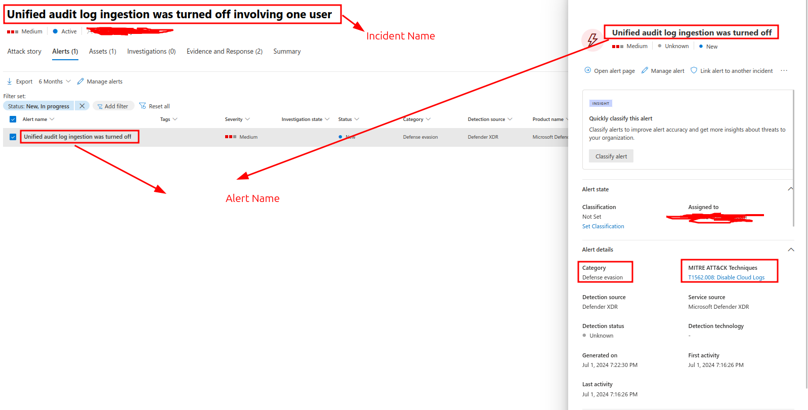
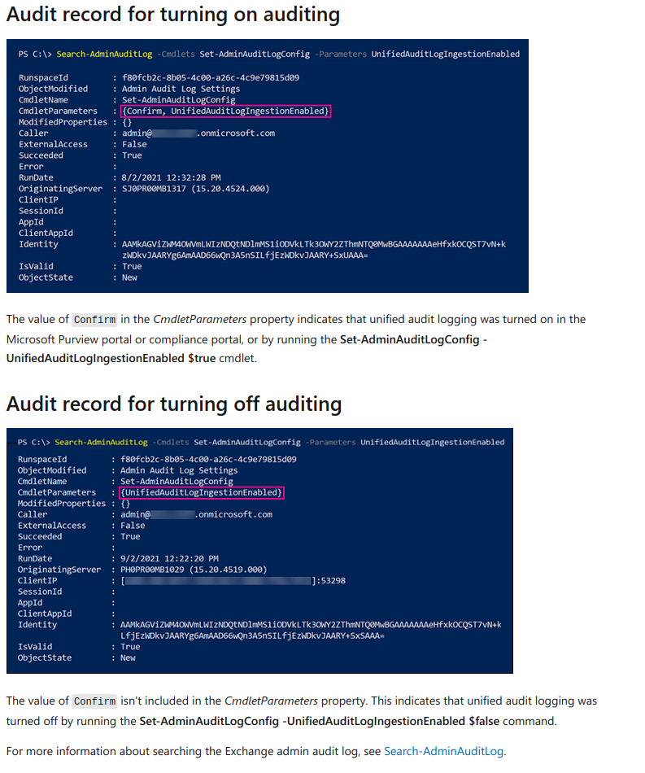

# [MITRE Technique-T1562.008: Disable Cloud Logs](https://attack.mitre.org/techniques/T1562/008/)  

## Disable Unified Audit Logs  
### Emulation:  
```
Connect-ExchangeOnlineManagement
Get-AdminAuditLogConfig |Select-Object -ExpandProperty UnifiedAuditLogIngestionEnabled
Set-AdminAuditLogConfig -UnifiedAuditLogIngestionEnabled $false
```

###
### Detection:
#### OfficeActivity logs
The below KQL query detects disabling of Unified Audit Logs.  
```
OfficeActivity
| where OfficeWorkload=="Exchange"
| where Operation=="Set-AdminAuditLogConfig"
| where ResultStatus==true
| mv-expand Parameters=parse_json(Parameters)
| where Parameters.Name=="UnifiedAuditLogIngestionEnabled" and Parameters.Value=="False"
| extend AppName=iff(AppId=="fb78d390-0c51-40cd-8e17-fdbfab77341b","Microsoft Exchange REST API Based Powershell",AppId)
| project TimeGenerated,ElevationTime, UserType,Operation,ResultStatus, OfficeObjectId, UserId, ClientIP, ExternalAccess, AppName, OrganizationName
```
#### Defender XDR
Disabling Unified Audit Logs generates an Incident in Microsoft Defender XDR(Microsoft 365 Defender) as shown.
* **Incident Name**: Unified audit log ingestion was turned off involving one user
* **AlertName**: Unified audit log ingestion was turned off

  
#### Via Powershell
You can also detect via powershell commands.  
```Search-AdminAuditLog -Cmdlets Set-AdminAuditLogConfig -Parameters UnifiedAuditLogIngestionEnabled```  


#### Disable Audit Log Via Disabling License.
```
//Find disabled license plans
AuditLogs
| where TimeGenerated > ago(20m)
| where OperationName == "Change user license"
| mv-expand TargetResources
| extend InitiatedApp=tostring(InitiatedBy.app.displayName)
| extend InitiatedPrincipalId=tostring(InitiatedBy.app.servicePrincipalId)
| extend InitiatedUser=tostring(InitiatedBy.user.userPrincipalName)
| extend TargetUser=tostring(TargetResources.userPrincipalName)
| extend ipAddress=tostring(InitiatedBy.user.ipAddress)
| extend value=parse_json(AdditionalDetails[2].value)
| extend AppDisplayName=tostring(InitiatedBy.user.displayName)
| extend sequence=toint(AdditionalDetails[1].value)
| extend maximumlength=toint(AdditionalDetails[3].value)
| sort by sequence asc 
| summarize TimeGenerated=min(TimeGenerated),OperationName=make_set(OperationName)[0],InitiatedVia=make_list(AppDisplayName)[0],InitiatedUser=make_list(InitiatedBy.user.userPrincipalName)[0], TargetUser=make_list(TargetUser)[0], ipAddress=make_list(ipAddress)[0],InitiatedApp=make_list(InitiatedApp)[0],InitiatedPrincipalId=make_list(InitiatedPrincipalId)[0],LicenceUpdateProperties=strcat_array(make_list(value), '') by CorrelationId // strcat_array function combines the divided modified properties into one proper json value.
| extend AssignedLicense=parse_json(tostring(parse_json(LicenceUpdateProperties).targetUpdatedProperties))[0]
| extend AssignedLicenseNewValue=array_sort_asc(parse_json(tostring(parse_json(LicenceUpdateProperties).targetUpdatedProperties))[0].NewValue)
| extend AssignedLicenseOldValue=array_sort_asc(parse_json(tostring(parse_json(LicenceUpdateProperties).targetUpdatedProperties))[0].OldValue)
| extend AssignedLicenseDetails=parse_json(tostring(parse_json(LicenceUpdateProperties).targetUpdatedProperties))[2]
| extend AssignedLicenseDetailsNewValue=array_sort_asc(parse_json(tostring(parse_json(LicenceUpdateProperties).targetUpdatedProperties))[2].NewValue)
| extend AssignedLicenseDetailsOldValue=array_sort_asc(parse_json(tostring(parse_json(LicenceUpdateProperties).targetUpdatedProperties))[2].OldValue)
| mv-expand AssignedLicenseNewValue, AssignedLicenseDetailsNewValue,AssignedLicenseDetailsOldValue, AssignedLicenseOldValue
//convert the string data to proper dictionary
| extend AssignedLicenseNewValue=iff(isnotempty(AssignedLicenseNewValue),parse_json(strcat('{"',substring(replace_string(replace_string(replace_string(replace_string(replace_string(tostring(parse_json(AssignedLicenseNewValue)),'=[','":["'),"=",'":"'),",",'","'),"]]",'"]}'),'" ','"'),1))),parse_json(''))
| extend AssignedLicenseOldValue=iff(isnotempty(AssignedLicenseOldValue),parse_json(strcat('{"',substring(replace_string(replace_string(replace_string(replace_string(replace_string(tostring(parse_json(AssignedLicenseOldValue)),'=[','":["'),"=",'":"'),",",'","'),"]]",'"]}'),'" ','"'),1))),parse_json(''))
| where isnotempty(parse_json(AssignedLicenseNewValue).DisabledPlans[0])  //exclude records that does not have any disabled plans
| extend OldSkuName=tostring(AssignedLicenseOldValue.SkuName)
| extend NewSkuName=tostring(AssignedLicenseNewValue.SkuName)
| extend Oldskuid=tostring(AssignedLicenseDetailsOldValue.SkuId)
| extend NewSkuid=tostring(AssignedLicenseDetailsNewValue.SkuId)
| extend OldDisabledPlan=AssignedLicenseOldValue.DisabledPlans
| extend NewDisabledPlan=AssignedLicenseNewValue.DisabledPlans
| extend OldDisabledPlanGUID=AssignedLicenseDetailsOldValue.DisabledPlans
| extend NewDisabledPlanGUID=AssignedLicenseDetailsNewValue.DisabledPlans
| where OldSkuName==NewSkuName   // both the SKU names should be same. Then only we can calculate what has changed from old and new for each SKU license.
| extend ['Disabled Service Plan']=iff(isnotempty(OldDisabledPlan[0]),set_difference(NewDisabledPlan,OldDisabledPlan),NewDisabledPlan)
| extend ['Disabled Service Plan GUID']=iff(isnotempty(OldDisabledPlanGUID[0]), set_difference(NewDisabledPlanGUID,OldDisabledPlanGUID),NewDisabledPlanGUID)
| where array_length(['Disabled Service Plan'])!=0 // Do not show any empty values. This can occur if there are any errors.
| project TimeGenerated,OperationName, InitiatedUser, InitiatedVia, ipAddress,TargetUser,['Disabled Service Plan'],['Disabled Service Plan GUID'],AssignedLicense, LicenceUpdateProperties, OldSkuName, NewSkuName, OldDisabledPlan, NewDisabledPlan, InitiatedApp, InitiatedPrincipalId
```

## Disable Admin Audit Logs  
### Emulation
```
Get-AdminAuditLogConfig | Format-List AdminAuditLogEnabled
Set-AdminAuditLogConfig -AdminAuditLogEnabled $False
```
### Detection: 
The below KQL query detects disabling of Admin Audit Logs.  
```
OfficeActivity
| where OfficeWorkload=="Exchange"
| where Operation=="Set-AdminAuditLogConfig"
| where ResultStatus==true
| mv-expand Parameters=parse_json(Parameters)
| where Parameters.Name=="AdminAuditLogEnabled" and Parameters.Value=="False"
| extend AppName=iff(AppId=="fb78d390-0c51-40cd-8e17-fdbfab77341b","Microsoft Exchange REST API Based Powershell",AppId)
| project TimeGenerated,ElevationTime, UserType,Operation,ResultStatus, OfficeObjectId, UserId, ClientIP, ExternalAccess, AppName, OrganizationName
```
## Disable Mailbox Auditing
### Emulation

```
# Get to know the mailbox auditing enabled for the organization
Get-OrganizationConfig | Format-List AuditDisabled
#Get to know the mailbox auditing enabled or disabled for a user.
Get-MailboxAuditBypassAssociation -Identity <UserEmail> | select AuditBypassEnabled
Get-Mailbox -Identity <UserMail> | select AuditEnabled                 
#Bypass mailbox auditing for a user
Set-MailboxAuditBypassAssociation -Identity <UserEmail> -AuditBypassEnabled $true
#Bypass Detection query using -Confirm parameter
Set-MailboxAuditBypassAssociation -Identity <UserEmail> -AuditBypassEnabled $true -Confirm:$true 
Set-MailboxAuditBypassAssociation -Identity <UserEmail> -AuditBypassEnabled $true -Confirm:$false
#Attempt to disable mailbox auditing for a user
Set-Mailbox -Identity "<UserEmail>" -AuditEnabled $false 
```
### Detection
The following query detects _mailbox auditing bypass_. This detection also identifies attempts to bypass detection by appending the Confirm parameter.
```
OfficeActivity
| where TimeGenerated >ago(1h)
| where Operation == "Set-MailboxAuditBypassAssociation"
| extend AuditBypassEnabled=iff(parse_json(Parameters)[0].Name=="AuditBypassEnabled",parse_json(Parameters)[0].Value,iff(parse_json(Parameters)[1].Name=="AuditBypassEnabled",parse_json(Parameters)[1].Value,''))
| where AuditBypassEnabled=="True"
| extend TargetUser=iff(parse_json(Parameters)[1].Name=="Identity",parse_json(Parameters)[1].Value,iff(parse_json(Parameters)[2].Name=="Identity",parse_json(Parameters)[2].Value,''))
| where ResultStatus=="True"
| project TimeGenerated, Operation, UserId, TargetUser,  AuditBypassEnabled, ClientIP, UserType, RecordType,ResultStatus,ExternalAccess, Parameters
```
The below query detects the attempts to disable mailbox auditing via Set-Mailbox command.  
```
OfficeActivity
| where TimeGenerated >ago(1h)
| where Operation=="Set-Mailbox"
| extend parsedParam=parse_json(Parameters) 
| extend AppName=iff(AppId=="fb78d390-0c51-40cd-8e17-fdbfab77341b","Microsoft Exchange REST API Based Powershell",'')
| mv-expand parsedParam
| extend AuditingEnabled=iff(parse_json(parsedParam).Name=="AuditEnabled",parse_json(parsedParam).Value,'')
| where AuditingEnabled=="False"
| where ResultStatus=="True"
| project TimeGenerated,RecordType,UserType,ClientIP, UserId,AuditingEnabled,Operation,SourceRecordId,ResultStatus, Parameters,ExternalAccess, AppId, AppName
| join kind=inner(
OfficeActivity
| where TimeGenerated >ago(1h)
| where Operation=="Set-Mailbox"
| extend parsedParam=parse_json(Parameters) 
| mv-expand parsedParam
| extend TargetUser=iff(parse_json(parsedParam).Name=="Identity",parse_json(parsedParam).Value,'')
| where isnotempty(TargetUser)
| project TimeGenerated,UserId, SourceRecordId, TargetUser, Operation) on SourceRecordId,UserId
| project TimeGenerated,ClientIP, UserId,AuditingEnabled,Operation,TargetUser,ResultStatus,RecordType,UserType,SourceRecordId, Parameters,ExternalAccess, AppId, AppName
```
