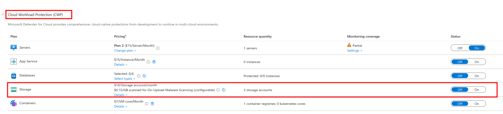
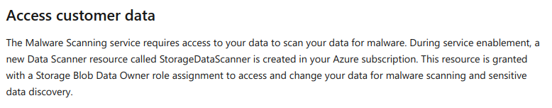
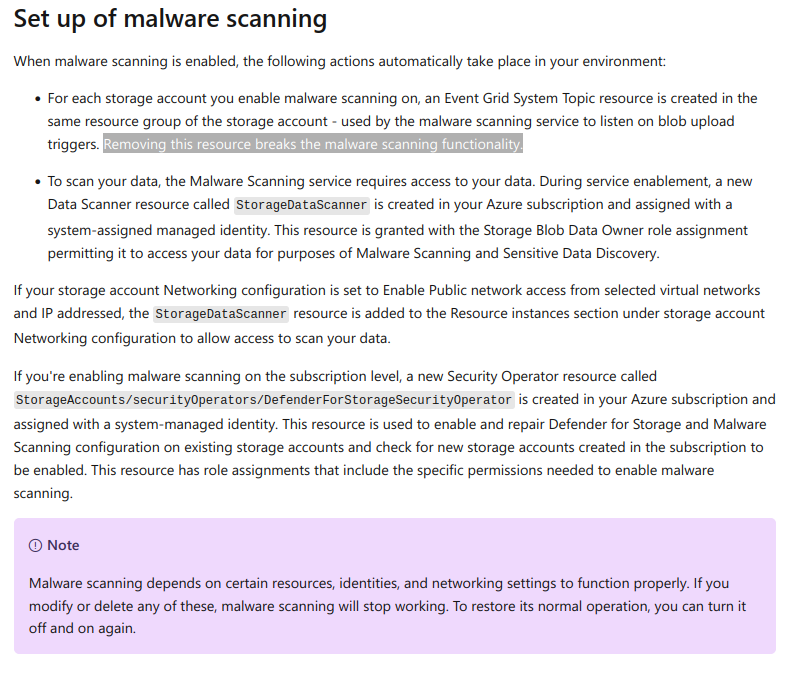

## Disable cloud workload protection 
Attackers may disable the cloud workload protection service(Defender For Storage) which raises security alerts upon detection of malicious activities in cloud storage services.   
Microsoft Defender for Storage provides comprehensive security by analyzing the data plane and control plane telemetry generated by Azure Blob Storage, Azure Files, and Azure Data Lake Storage services. It uses advanced threat detection capabilities powered by Microsoft Threat Intelligence, Microsoft Defender Antivirus, and Sensitive Data Discovery to help you discover and mitigate potential threats.  


### MITRE ATT&CK
| Tactic | Technique | Link    |
| ---  | --- | --- |
| TA0005-Defense Evasion | MS-T811-Disable cloud workload protection | https://microsoft.github.io/Threat-matrix-for-storage-services/techniques/disable-protection-service/|
| |T1562.001-Impair Defenses: Disable or Modify Tools | https://attack.mitre.org/techniques/T1562/001/ |

Removing Cloud Workload Protection for storage accounts generates several events. Among these, the EVENTSUBSCRIPTIONS/DELETE event is the most specific and relevant for constructing KQL queries. However, for full clarity, please also consider the other events occurring at the same time during your investigation.  

- _MICROSOFT.SECURITY/PRICINGS/WRITE_
- _MICROSOFT.SECURITY/ADVANCEDTHREATPROTECTIONSETTINGS/WRITE_  
- _MICROSOFT.SECURITY/DEFENDERFORSTORAGESETTINGS/WRITE_
- _MICROSOFT.SECURITY/DATASCANNERS/WRITE_
- _**MICROSOFT.EVENTGRID/SYSTEMTOPICS/DELETE**_  
- _**MICROSOFT.EVENTGRID/EVENTSUBSCRIPTIONS/DELETE**_  
- _MICROSOFT.SECURITY/DATASCANNERS/DELETE_

The below query detects if defender for storage plan is disabled or removed  


```  

AzureActivity
| where OperationNameValue=="MICROSOFT.EVENTGRID/EVENTSUBSCRIPTIONS/DELETE"//
//Otherevents for correlation "MICROSOFT.EVENTGRID/SYSTEMTOPICS/DELETE","MICROSOFT.SECURITY/DATASCANNERS/DELETE"
// Use the event MICROSOFT.SECURITY/PRICINGS/WRITE for the actual caller(Actor/Who) initiated the operation.
| where ResourceProviderValue=="MICROSOFT.STORAGE"
| where ActivityStatusValue=="Success"
| extend Resource=tostring(Properties_d.resource)
| extend Entity=tostring(Properties_d.entity)
| extend Role=Authorization_d.evidence.role
| extend CloudWorkLoadProtection=array_split(split(Entity,'/',-1),-1)[1][0]
| extend StorageAccount=trim_end(@"\/.*$",Resource)
| project TimeGenerated,OperationNameValue,CloudWorkLoadProtection, Caller, CallerIpAddress, ActivityStatusValue,StorageAccount,Resource, ResourceGroup, ResourceProviderValue, Entity, CorrelationId, Properties_d, Authorization_d

```
**NOTE:** For pivoting the actual user(actor) who initiated this operation use the event MICROSOFT.SECURITY/PRICINGS/WRITE for the same event timeline.  

```
AzureActivity
| where TimeGenerated >ago(3h)
| where OperationNameValue=="MICROSOFT.SECURITY/PRICINGS/WRITE"
| where Properties_d.resource=="storageaccounts"
```

  


