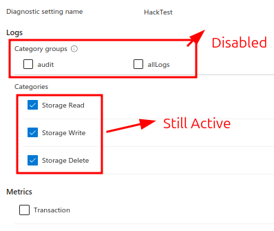
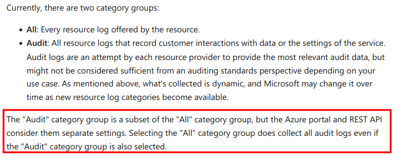

## Disable/Delete audit logs
Attackers may disable storage account audit logs to prevent event tracking and avoid detection. Audit logs provide a detailed record of operations performed on a target storage account and may be used to detect malicious activities. Thus, disabling these logs can leave a resource vulnerable to attacks without being detected.  
### MITRE ATT&CK
| Tactic | Technique | Link    |
| ---  | --- | --- |
| TA0005-Defense Evasion | MS-T810-Disable audit logs |https://microsoft.github.io/Threat-matrix-for-storage-services/techniques/disable-audit-logs/|
|| T1562.008-Impair Defenses: Disable or Modify Cloud Logs|https://attack.mitre.org/techniques/T1562/008/|  

The below query detects deletion of azure diagnostic settings for disabling the logs.
```
AzureActivity
| where OperationNameValue=~"MICROSOFT.INSIGHTS/DIAGNOSTICSETTINGS/DELETE"
| where ResourceProviderValue=~"MICROSOFT.STORAGE"
| where ActivityStatusValue=="Success"
| extend DiagnosticSettingName=tostring(Properties_d.resource)
| extend Scope = tostring(Properties_d.entity)
| extend Role=tostring(parse_json(Authorization).evidence.role) //Use this role value to pivor further
| project TimeGenerated,Caller,CallerIpAddress,OperationNameValue, ActivityStatusValue, DiagnosticSettingName,ResourceGroup, ResourceProviderValue, Scope,Role

```
The following query detects the modification of diagnostic settings to disable a specific category of logs, primarily audit logs  

```
AzureActivity
| where TimeGenerated >ago(90m)
| where OperationNameValue=~"MICROSOFT.INSIGHTS/DIAGNOSTICSETTINGS/WRITE"
| where ResourceProviderValue=~"MICROSOFT.STORAGE"
| extend DiagnosticSettingName=tostring(Properties_d.resource)
| extend Scope = tostring(Properties_d.entity)
| extend Role=tostring(parse_json(Authorization).evidence.role)
| extend LogType=parse_json(tostring(parse_json(tostring(parse_json(tostring(parse_json(Properties).requestbody)).properties)).logs))
| extend LogType1 = iff(tostring(LogType[0].categoryGroup)==bool(null),tostring(LogType[0].category),tostring(LogType[0].categoryGroup))
| extend LogType1enabled = tostring(LogType[0].enabled)
| extend MetricLogs=tostring(parse_json(tostring(parse_json(tostring(parse_json(tostring(Properties_d.requestbody)).properties)).metrics))[0].category)
| extend MetricLogsenabled = tostring(parse_json(tostring(parse_json(tostring(parse_json(tostring(Properties_d.requestbody)).properties)).metrics))[0].enabled)
| extend LogType2 = iff(tostring(LogType[1].categoryGroup)==bool(null),tostring(LogType[1].category),tostring(LogType[1].categoryGroup))
| extend LogType2enabled = tostring(LogType[1].enabled)
| extend StorageDeleteLog=iff(isnotnull(tostring(LogType[2])),tostring(LogType[2].enabled),'')
//| where (LogType1 in ("audit","StorageRead") and LogType1enabled=="false") or (LogType2=="StorageWrite" and LogType2enabled=="false") or StorageDeleteLog==false
| project TimeGenerated,Caller,CallerIpAddress,OperationNameValue, ActivityStatusValue, DiagnosticSettingName,ResourceGroup, ResourceProviderValue, Scope,Role, CorrelationId,LogType1,LogType1enabled,LogType2,LogType2enabled,MetricLogs,MetricLogsenabled, StorageDeleteLog, LogType
| join (AzureActivity
| where TimeGenerated >ago(90m)
| where OperationNameValue=~"MICROSOFT.INSIGHTS/DIAGNOSTICSETTINGS/WRITE"
| where ResourceProviderValue=~"MICROSOFT.STORAGE"
| where ActivityStatusValue=="Success"
| extend DiagnosticSettingName=tostring(Properties_d.resource)
| extend Scope = tostring(Properties_d.entity)
| extend Role=tostring(parse_json(Authorization).evidence.role)
| project TimeGenerated,Caller,CallerIpAddress,OperationNameValue, ActivityStatusValue, DiagnosticSettingName,ResourceGroup, ResourceProviderValue, Scope,Role, CorrelationId) on CorrelationId
| project StartTime=TimeGenerated,EndTime=TimeGenerated1,Caller,CallerIpAddress,OperationNameValue, ActivityStatusValue=ActivityStatusValue1, DiagnosticSettingName,ResourceGroup, ResourceProviderValue, Scope,Role, CorrelationId,LogType1,LogType1enabled,LogType2,LogType2enabled,MetricLogs,MetricLogsenabled, StorageDeleteLog, LogType

```
**Note:** Disabling _Audit_ or _All_ CategoryGroup alone does not disable the audit log events. Instead explicitly the attacker has to disable the _StorageRead_, _StorageWrite_ and _StorageDelete_ Category logs.  
 
  
 


