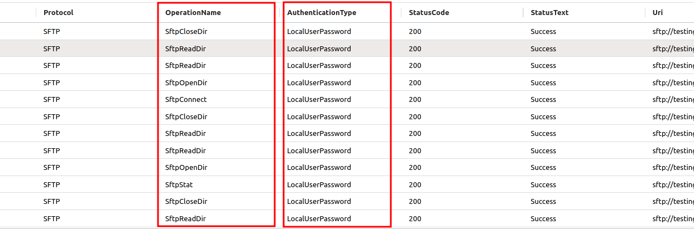

### SFTP Credentials
Attackers may obtain and abuse credentials of an SFTP account as a means of gaining initial access. SFTP is a prevalent file transfer protocol between a client and a remote service. Once the user connects to the cloud storage service, the user can upload and download blobs and perform other operations that are supported by the protocol. SFTP connection requires SFTP accounts which are managed locally in the storage service instance, including credentials in a form of passwords or key-pairs.


### MITRE ATT&CK
| Tactic | Technique | Link    |
| ---  | --- | --- |
|MS-T825-Initial Access |MS-T825-SFTP credentials |https://microsoft.github.io/Threat-matrix-for-storage-services/techniques/sftp-credentials/|
|MS-T821-Lateral movement | MS-T821-Malicious content upload|https://microsoft.github.io/Threat-matrix-for-storage-services/techniques/malicious-content-upload/|    


### Detection 
Any access using SFTP  
```
StorageBlobLogs  
| where Protocol=="SFTP"
| where StatusCode==200
| project TimeGenerated, AccountName, Protocol, OperationName, AuthenticationType, StatusCode, StatusText, Uri, CallerIpAddress, UserAgentHeader, RequesterObjectId
```
Failure attempts with wrong password  
```
StorageBlobLogs
| where TimeGenerated >ago(90m)
| where Protocol=="SFTP"
| where OperationName=="SftpConnect"
| where StatusCode==403
| project TimeGenerated, AccountName, Protocol, OperationName, AuthenticationType, StatusCode, StatusText, Uri, CallerIpAddress, UserAgentHeader, RequesterObjectId

```
Access using localuserpassword  
```
StorageBlobLogs  
| where Protocol=="SFTP"
| where StatusCode==200
| where AuthenticationType=="LocalUserPassword"
| project TimeGenerated, AccountName, Protocol, OperationName, AuthenticationType, StatusCode, StatusText, Uri, CallerIpAddress, UserAgentHeader, RequesterObjectId
```
Attackers may use storage services to store a malicious program or toolset that will be executed at later times during their operation. In addition, adversaries may exploit the trust between users and their organization’s Storage services by storing phishing content. Furthermore, storage services can be leveraged to park gathered intelligence that will be exfiltrated when terms suit the actor group.

Uploading malicious  backdoor 

```
StorageBlobLogs
| where TimeGenerated >ago(90m)
| where Protocol=="SFTP"
| where StatusCode==200
| where AuthenticationType=="LocalUserPassword"
| where OperationName in ('SftpCreate','SftpWrite','SftpCommit')
| project TimeGenerated, AccountName, Protocol, OperationName, AuthenticationType, StatusCode, StatusText, Uri, CallerIpAddress, UserAgentHeader, RequesterObjectId
```
#### Notable Fields from logs
  

#### Some common operationnames from the logs for associated sftp actions:


Upload new files (put operation)
Triggered when a blob is created or overwritten.
Specifically, this event is triggered when clients use the put operation, which corresponds to the SftpCreate and SftpCommit APIs. An empty blob is created when the file is opened and the uploaded contents are committed when the file is closed. If the SFTP Resumable Uploads preview feature is enabled then some SftpWrite events will also be triggered during the upload.  
- SftpCreate
- SftpWrite
- SftpCommit

Create Folder  
- SftpMakeDir

Listing directory creates following actions  
- SftpOpenDir
- SftpReadDir
- SftpCloseDir

Change Directory    
- SftpStat
  
Download File using get command generates following events.  
- SftpOpen
- SftpRead
- SftpClose
